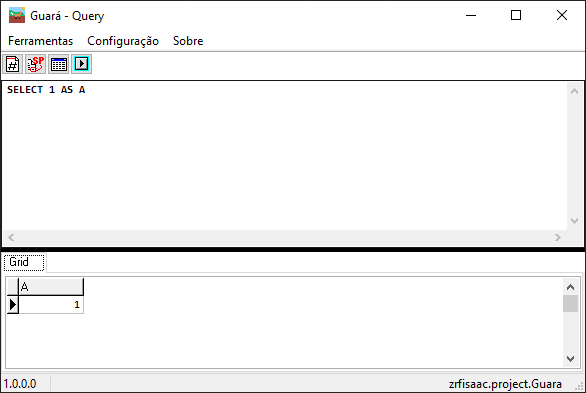

[//]: # (# [ zrfisaac ])

[//]: # (# [ about ])
[//]: # (# - author : Isaac Santana)
[//]: # (# . - email : zrfisaac@gmail.com)
[//]: # (# . - site : zrfisaac.github.io)

[//]: # (# [ markdown ])

[//]: # (# - language)

[//]: # (# - title)

#  Guará

